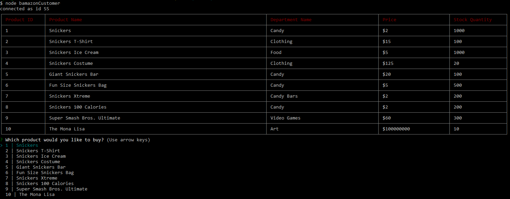
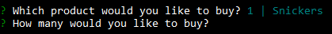
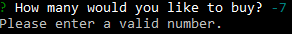
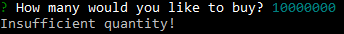
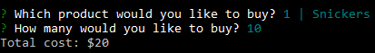
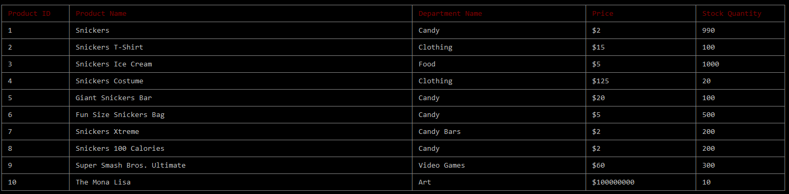

# Bamazon-Marketplace
A market to buy and sell goods. The Bamazon Customer is able to choose goods from a list and purchase an integer number of the item using inquirer, as long as that item has sufficient quantity to supply that order. The total cost of their order is then displayed, and the database is updated to reflect the lowered quantity, while product_sales are increased by the cost of the order.

This is the table and options first displayed upon running bamazonCustomer.js

This is the numeric input after choosing a product.

If the number is invalid, such as a negative number or a string, this error message is displayed.

If the customer tries to purchase more product than is available, this error message is displayed.

The total cost of their purchase is then displayed to the customer.

The database is updated when the customer makes a purchase, as can be seen when running the function again. 
(I ordered more Snickers between my first run and this table, which is why the discrepancy is 20 and not 10)

